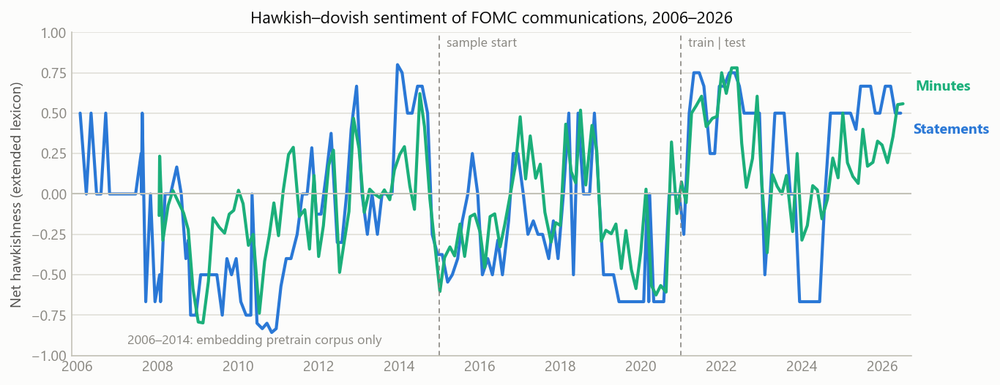

# fed-sentiment-research

Alternative-data research project: extract a hawkish/dovish sentiment signal
from **Federal Reserve communications** (FOMC statements and meeting minutes,
2006–2026) and honestly test whether it predicts anything in equity or bond
markets. Text is the input here — every other project in this portfolio works
on price/volume data.

**This is a research repo, not a trading system.** No broker connection, no
execution. The interesting deliverable is the validation methodology and the
honest result.

## Honest headline result

> The sentiment scores **measure something real but predict nothing
> tradable**. The extended lexicon's hawkishness level co-moves with
> same-day 2y/10y Treasury yield changes with the right sign in *both* the
> train and test split (test: r = +0.49 / +0.52, surviving Bonferroni) — but
> that reaction is contemporaneous and complete within the day. Across 108
> forward-looking hypotheses per split, **zero** survive multiple-testing
> correction, the top-5 in-sample correlations fail to replicate out of
> sample (3 of 5 flip sign), and the pre-registered primary hypothesis is
> null with an unstable sign. Full details and the look-ahead audit are in
> [REPORT.md](REPORT.md).



## What's inside

| Piece | What it does |
|---|---|
| `fedsent/scrape.py` | Downloads all FOMC statements + minutes 2006–2026 from federalreserve.gov (polite, rate-limited, cached). Minutes are timestamped by their **release date** (~3 weeks after the meeting), never the meeting date. |
| `fedsent/lexicon.py` | Approach 1: hawkish/dovish scoring with the Apel & Blix Grimaldi (2012, Riksbank WP 261) direction-word × noun lexicon, plus a clearly-labelled FOMC-English extension. |
| `fedsent/embed.py` | Approach 2: PPMI-SVD word embeddings (Levy & Goldberg 2014) trained **only on pre-2015 text**, hawk–dove SemAxis projection. Built from scratch in numpy — no torch wheels exist for Python 3.14, and no paid APIs allowed. |
| `fedsent/validate.py` | Pre-registered event study: announcement-day (measure validation) vs. 1/5/21-day forward moves of SPY, DGS2, DGS10; train ≤ 2020 / test ≥ 2021; Bonferroni-corrected grid. |
| `tests/` | 34 pytest tests: lexicon semantics, HTML extraction on real page fixtures, embedding math, event-study alignment (incl. the weekend/look-ahead case). No network access in tests. |
| `REPORT.md` | The research report: methods, results, limitations, explicit look-ahead bias audit, honest verdict. |

## Reproduce

```
pip install -r requirements.txt
python scripts/download_fomc.py      # ~330 pages, a few minutes, cached
python scripts/download_market.py    # SPY (Yahoo), DGS2/DGS10 (FRED)
python scripts/score_documents.py    # trains embeddings, scores 321 documents
python scripts/run_validation.py     # writes output/validation_grid.csv + summary.txt
python scripts/make_figures.py       # writes output/figures/*.png
python -m pytest tests -q            # 34 tests
```

Data sources are free and keyless: federalreserve.gov (public documents),
FRED `fredgraph.csv` (Treasury yields), Yahoo Finance chart API (SPY,
dividend-adjusted closes).

## Design choices worth reading

- **No look-ahead by construction**: minutes aligned to verified release
  dates (calendar text cross-checked against each page's "Last Update"
  footer); embeddings frozen on pre-sample text; forward returns based at
  the first close *after* publication. The full audit is in REPORT.md §7.
- **Pre-registration discipline**: the primary hypothesis and all
  hyperparameters are fixed in docstrings before any correlation was
  computed; everything else is labelled exploratory and Bonferroni-flagged.
- **The null result is reported as a null result.**
