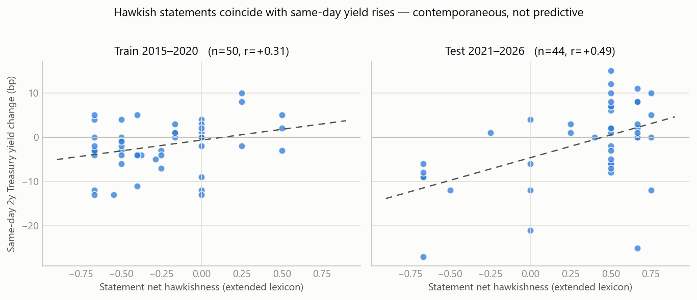
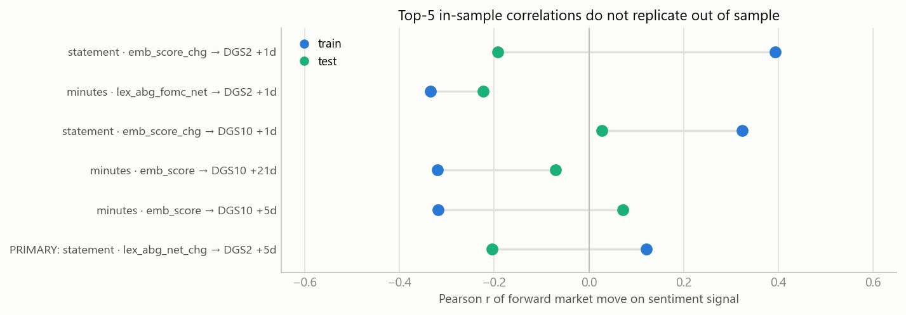

# Does Fed-speak predict markets? An honest event study of FOMC sentiment

*Research report — fed-sentiment-research, July 2026.*

## 1. Question and verdict

Can a hawkish/dovish sentiment score extracted from FOMC statements and
minutes predict subsequent moves in equities (SPY) or Treasury yields
(2y, 10y)?

**Verdict: the scores measure something real, but predict nothing
tradable.**

- The extended lexicon's hawkishness level co-moves with **same-day**
  Treasury yield changes with the economically correct sign in both the
  train and the test split (test: DGS2 r = +0.49, p = 0.0007; DGS10
  r = +0.52, p = 0.0003 — both survive Bonferroni within their family).
  Hawkish text and rising yields happen together on announcement day, which
  validates the measurement.
- **Forward-looking, nothing survives.** Across 108 forward hypotheses per
  split, zero pass Bonferroni in either split. The five strongest in-sample
  correlations (|r| = 0.32–0.39, p < 0.03) all fail to replicate out of
  sample; three of five flip sign. The pre-registered primary hypothesis is
  null: train r = +0.12 (p = 0.40), test r = −0.21 (p = 0.18).
- The market appears to price statement content within the announcement
  day. By the first close after publication — the earliest moment a reader
  of the text could trade — the text carries no measurable edge at 1-, 5-,
  or 21-day horizons.

This is a negative result and it is reported as one.

## 2. Data

| Corpus | Count | Range | Source |
|---|---|---|---|
| FOMC statements | 172 | 2006-01 – 2026-06 | federalreserve.gov press releases |
| FOMC minutes | 149 | 2007-10 – 2026-06 | federalreserve.gov |
| SPY daily adj. closes | 3,145 | 2014-01 – 2026-07 | Yahoo Finance chart API |
| DGS2, DGS10 yields | 3,127 | 2014-01 – 2026-07 | FRED (fredgraph.csv) |

Scraping notes (all verifiable in `fedsent/scrape.py` and the download log):

- Discovery walks the Fed's calendar page plus one archive page per older
  year; both statement URL generations are handled. Four non-statement
  press releases matching the URL pattern (implementation notes,
  longer-run-goals updates, a FIMA facility announcement) were excluded by
  a page-title check and are listed by the script — nothing is silently
  dropped.
- **Minutes release dates are load-bearing** (minutes go public ~3 weeks
  after the meeting) and were taken from the calendar pages' "(Released
  ...)" text, falling back to each page's "Last Update" footer; the two
  agree where both exist. All 93 in-sample minutes have verified release
  dates (lags: 19–24 days). Aligning minutes to meeting dates instead
  would have been a look-ahead bug.
- The validation sample is 2015-01 onward: 94 statement events and 93
  minutes events. Documents from 2006–2014 are used **only** to train the
  embedding space (§3.2).

## 3. Two scoring methods

### 3.1 Lexicon (approach 1)

Primary lexicon: **Apel & Blix Grimaldi (2012), "The Information Content of
Central Bank Minutes", Sveriges Riksbank Working Paper No. 261** (open
access via EconStor, handle 10419/81866). Word lists were transcribed from
the paper itself (Section 6, footnotes 11 and 15): direction adjectives
{high(er), strong(er), fast(er), increasing, increased} vs {low(er),
weak(er), slow(er), decreasing, decreased} paired with policy nouns
{inflation*, price*, wage*, oil price*, cyclical position*, growth*,
development*} plus their extended list {employment*, unemployment*,
recovery*, cost*}. Document score = Net Index = (hawk − dove)/(hawk +
dove + 1).

Documented adaptations (fixed a priori, detailed in `fedsent/lexicon.py`):
nearest-noun attachment within a 3-token window (the original scored
adjacent bigrams in Swedish), an inverted sign for "unemployment", no
negation handling (as in the original).

**Honest finding about the strict lexicon:** it is too sparse for modern
FOMC statements — 45 of 94 in-sample statements (48%) contain *zero*
matching pairs, pinning their score at exactly 0. FOMC statements say
"inflation has *risen*" or "remains *elevated*", not "higher inflation".
A second variant (`abg_fomc`) therefore extends the direction lists with
common FOMC verbs/adjectives (rose/risen, declined, elevated, subdued,
moderated, ...). It is our extension, clearly labelled, and evaluated
separately; on minutes the two variants correlate at +0.82, on statements
+0.68.

### 3.2 Embeddings (approach 2)

A pretrained transformer (e.g. FOMC-RoBERTa; Shah, Paturi & Chava 2023) was
the obvious candidate, but this machine runs Python 3.14 and **no ML
runtime ships cp314 wheels** (torch, onnxruntime, model2vec all fail to
resolve), and API-based scoring violates the no-cost constraint. Two
side-benefits of not using it: zero inference cost, and no risk of the
model having *seen* the evaluation documents during its own training
(FOMC-RoBERTa was trained on FOMC text through 2022 — using it on a
2015–2022 backtest would itself be a form of look-ahead).

Instead, classical distributional embeddings built from scratch
(numpy/scipy only):

- **PPMI co-occurrence matrix + truncated SVD** (Levy & Goldberg 2014 show
  this is what word2vec SGNS implicitly factorises; smoothing α = 0.75 and
  symmetric √Σ weighting per Levy, Goldberg & Dagan 2015).
- Trained **only on the 135 pre-sample documents (2006–2014)**: 23,544
  sentences, 582k tokens, vocabulary 2,680. The space is frozen before the
  evaluation sample begins.
- **SemAxis** (An, Kwak & Ahn 2018): hawk–dove axis = mean(hawkish seed
  vectors) − mean(dovish seed vectors); a document scores as the mean
  cosine of its sentences with the axis. Seeds are policy-stance words
  fixed a priori (tighten/tightening/restrictive/... vs
  ease/easing/accommodative/...), never edited after seeing results.

Qualitative sanity checks of the frozen space look reasonable
("inflation" → expectations, stable, anchored, subdued; "accommodation" →
remove, removing, begin, eventually) with one revealing exception:
"tightening" neighbours (credit availability, adverse, depress,
deterioration) show that in 2006–2014 text the word predominantly meant
*credit-conditions* tightening, not policy tightening. That ambiguity
matters below.

## 4. Validation design (pre-registered)

Fixed in `fedsent/validate.py` before any correlation was computed:

- **Event timing.** Statements are public at 14:00 ET on the meeting day;
  minutes at 14:00 ET on their release day. Closes are 16:00 ET, so the
  event-day close already reflects the text. Forward moves are based at
  t0 = first trading day ≥ publication: `close(t0) → close(t0+k)`,
  k ∈ {1, 5, 21}. Weekend/holiday releases roll *forward* to the next
  close, never back.
- **Announcement-day reaction** (t0−1 → t0) is measure validation only —
  contemporaneous, not tradable — reported separately, motivated by the
  monetary-surprise literature (Kuttner 2001; Gürkaynak, Sack & Swanson
  2005).
- **Signals**: each score's level and its change vs the previous same-type
  document. **Assets**: SPY (returns), DGS2, DGS10 (yield changes, bp).
- **Split**: train = events ≤ 2020-12-31 (n = 50 statements / 45 minutes),
  test = 2021+ (44 / 48). Consecutive same-type events are ~6 weeks apart,
  so even 21-day forward windows do not overlap within an event set.
- **Primary hypothesis (a priori)**: the change in statement `lex_abg_net`
  correlates positively with (a) announcement-day and (b) 5-day forward
  DGS2 changes. Everything else: exploratory, Bonferroni-corrected
  (forward family: 108 tests/split → α = 4.6e-4; announcement family: 36
  tests/split → α = 1.4e-3).

## 5. Results

### 5.1 Measure validation (announcement day — not tradable)

The registered check on the strict lexicon's *change* is **null** (train
r = +0.02, test r = +0.00) — unsurprising given the 48% zero-hit rate; the
difference of a mostly-zero series is noise.

The extended lexicon **level**, however, tracks same-day yield moves with
consistent sign in both independent splits:

| Signal (statements) | Asset | Train r (p) | Test r (p) |
|---|---|---|---|
| lex_abg_fomc_net | DGS2 | +0.31 (0.030) | **+0.49 (0.0007)** |
| lex_abg_fomc_net | DGS10 | +0.34 (0.016) | **+0.52 (0.0003)** |
| lex_abg_fomc_net | SPY | +0.06 (0.69) | +0.03 (0.85) |

Bold cells survive the family Bonferroni (α = 1.4e-3); the train-side
p-values do not, but the sign agreement across splits is the persuasive
part. Equities show nothing. Interpretation: hawkish statement language and
same-day bond repricing co-occur — the lexicon measures a real quantity.
(Causality is not claimed: the text and the policy decision arrive
together, and yields react to the decision too.)

The embedding score co-moves with the **opposite** sign (test DGS2: level
−0.43, change −0.47; train DGS10 change −0.51). Given the "tightening =
credit tightening" neighbourhood evidence and only weak positive agreement
with the lexicons (+0.10 to +0.32), we read this as **axis-polarity
unreliability of unsupervised seed projections**, not as a discovery.
Flipping the sign after seeing these numbers would be post-hoc; we
disclose instead.

### 5.2 Prediction (the actual question)

Null across the board:

- **Primary hypothesis**: train +0.12 (p = 0.40); test −0.21 (p = 0.18).
  Wrong-way sign out of sample; no effect.
- **Full forward grid** (108 tests per split): zero Bonferroni survivors
  in train, zero in test.
- **Replication check**: the five strongest train correlations, evaluated
  once on test:

| Spec (doc · signal → asset, horizon) | Train r (p) | Test r (p) |
|---|---|---|
| statement · emb_score_chg → DGS2 +1d | +0.39 (0.005) | −0.19 (0.21) |
| minutes · lex_abg_fomc_net → DGS2 +1d | −0.34 (0.020) | −0.22 (0.14) |
| statement · emb_score_chg → DGS10 +1d | +0.32 (0.022) | +0.03 (0.86) |
| minutes · emb_score → DGS10 +21d | −0.32 (0.027) | −0.07 (0.65) |
| minutes · emb_score → DGS10 +5d | −0.32 (0.027) | +0.07 (0.64) |

With ~50 events per split, |r| ≈ 0.28 is "significant" at p < 0.05 by
chance alone across a 108-cell grid many times over. The table is what
selection bias looks like when you force it to face fresh data.

### 5.3 Method comparison (Task 2 deliverable)

- Strict A&BG vs extended: +0.68 (statements) / +0.82 (minutes) — same
  construct, but the strict variant is unusably sparse on statements
  (48% exact zeros) while firing thousands of times on minutes.
- Lexicons vs embeddings: weak agreement (+0.10 to +0.32) and opposite
  market co-movement. The from-scratch embedding approach was worth
  building for the look-ahead-clean design, but as a *stance meter* the
  supervised-free axis is not trustworthy; with wheels for a proper
  fine-tuned classifier (or a second Python), FOMC-RoBERTa would be the
  natural upgrade — with the caveat about its training-data overlap noted
  in §3.2.
- The extended lexicon is the best measurement instrument of the three by
  the announcement-day criterion.

## 6. Limitations

1. **Small N.** ~50 events per split; only correlations this large
   (|r| ≳ 0.3) are even detectable, and confidence intervals are wide.
2. **No negation or hedging handling** in either lexicon variant (inherited
   from the source lexicon and disclosed). "Inflation is no longer
   elevated" scores hawkish.
3. **Activity words ≠ policy direction.** The Sep-2024 statement (a 50bp
   *cut*) scores +0.50 because "solid growth" vocabulary reads hawkish.
   The lexicon measures economic-assessment tone, which usually but not
   always aligns with the policy stance.
4. **Level vs surprise.** Without intraday futures data (Kuttner-style),
   the "surprise" proxy is a crude score difference. Much of a statement's
   content is anticipated; a text-only design cannot separate expected
   from unexpected hawkishness.
5. **Embedding axis polarity** is unreliable (§5.1); the pre-2015 corpus is
   small (582k tokens) and crisis-dominated.
6. **Two decision points were made by researchers who know 2015–2026
   history** (the FOMC-English direction-word extension; the inverted
   unemployment sign). Both are linguistically motivated, were fixed before
   any market data was touched, and were never iterated — but a purist
   should treat the extended-lexicon results as quasi-out-of-sample rather
   than strictly so. The strict cited lexicon carries no such caveat.

## 7. Look-ahead bias audit

| # | Channel | Status |
|---|---|---|
| 1 | Statement timing | Public 14:00 ET; forward base = same-day 16:00 close (post-release). Conservative: the first 2h of reaction are *excluded* from forward windows. |
| 2 | Minutes timing | Aligned to verified **release** dates (19–24 days post-meeting; calendar text cross-checked vs page footers; 0 estimated in sample). Meeting dates never used for availability. |
| 3 | Lexicon vintage | Published 2012, before the sample. Adaptations fixed a priori; extension variant caveat disclosed (§6.6). |
| 4 | Embedding training | Corpus strictly ≤ 2014-12-31; space frozen; seeds fixed a priori; scoring uses only each document's own words. This is also why no pretrained transformer was used (§3.2). |
| 5 | Non-trading-day events | Rolled forward via searchsorted(left); an assertion in `event_moves` guarantees base close ≥ publication date (tested, incl. the weekend case). |
| 6 | Spec selection | Train/test split by time; primary hypothesis registered in code before results; the only test-set usage is the single, reported-regardless evaluation of train-selected specs. |
| 7 | Data revisions | Yahoo adjusted closes embed retroactive dividend adjustments (negligible over ≤21-day windows); FRED yields can be trivially revised. Statements/minutes are never revised after release. |
| 8 | Survivorship | Not applicable: SPY and CMT yields are continuous series; every FOMC meeting in range is included, and all exclusions (4 non-statements) are itemised. |

## 8. What worked / what didn't

**Worked:** the scraper (321/321 documents, every exclusion itemised,
release-date verification via two independent sources); the strict-lexicon
sparsity diagnosis; the extended lexicon as a *measurement* instrument
(cross-split replicated announcement-day validity); the pre-registration +
Bonferroni + replication-table discipline, which correctly killed every
would-be "signal".

**Didn't:** the strict 2012 lexicon transplanted to terse modern FOMC
statements (48% zeros); the unsupervised embedding axis (polarity not
trustworthy); and — the headline — any attempt to *predict* returns or
yields from the text at daily-to-monthly horizons.

**If extended:** intraday data around release timestamps (the clean
Kuttner-style surprise design); a fine-tuned hawk/dove classifier once a
supported runtime is available; press-conference transcripts and dissent
counts as richer signals.

## 9. Reproduction

See README.md — five scripts, in order, plus `python -m pytest tests -q`
(34 tests, no network). All randomness is seeded (SVD initial vector);
scores and grids regenerate byte-identically given the same downloaded
corpus.

## References

- Apel, M. & Blix Grimaldi, M. (2012). *The Information Content of Central
  Bank Minutes*. Sveriges Riksbank Working Paper No. 261.
  https://www.econstor.eu/handle/10419/81866
- An, J., Kwak, H. & Ahn, Y.-Y. (2018). *SemAxis: A Lightweight Framework to
  Characterize Domain-Specific Word Semantics Beyond Sentiment*. ACL.
- Birz, G. & Lott, J. (2011). *The effect of macroeconomic news on stock
  returns: New evidence from newspaper coverage*. J. Banking & Finance.
- Gürkaynak, R., Sack, B. & Swanson, E. (2005). *Do Actions Speak Louder
  Than Words?* International Journal of Central Banking.
- Kuttner, K. (2001). *Monetary policy surprises and interest rates*.
  Journal of Monetary Economics.
- Levy, O. & Goldberg, Y. (2014). *Neural Word Embedding as Implicit Matrix
  Factorization*. NeurIPS.
- Levy, O., Goldberg, Y. & Dagan, I. (2015). *Improving Distributional
  Similarity with Lessons Learned from Word Embeddings*. TACL.
- Loughran, T. & McDonald, B. (2011). *When Is a Liability Not a
  Liability?* Journal of Finance. (Motivates context-specific wordlists.)
- Shah, A., Paturi, S. & Chava, S. (2023). *Trillion Dollar Words: A New
  Financial Dataset, Task & Market Analysis*. ACL. (The transformer
  alternative not used here; see §3.2.)

Data: Board of Governors of the Federal Reserve System (statements,
minutes); FRED, Federal Reserve Bank of St. Louis (DGS2, DGS10); Yahoo
Finance (SPY).
